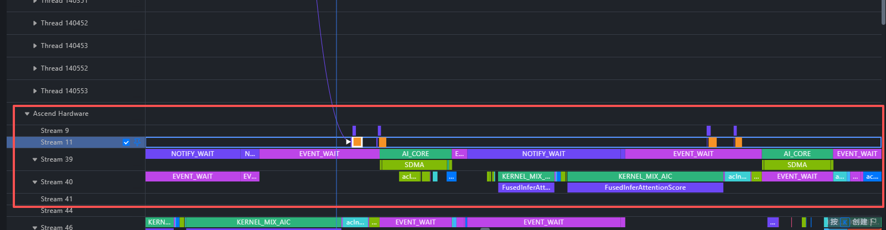

# Profiling 四维深度分析：DBO × FlashComm1 × AI_CPU vs AIV

本文档基于torch profile结果，深入分析 flashcomm，dbo，ai-cpu/aiv等不同参数配置对于prefill阶段推理的影响。

## 实验配置

```
Model:     DeepSeek-V2-Lite-Chat
Hardware:  Ascend 910B3 × 2 (20 AIC : 24 AIV)
TP: 2, EP: 2
Compile:  torch.compile fullgraph (28 subgraphs/rank)
CANN:     9.0.0, torch_npu 2.10.0
```

## 四个 Profile 对照表

| # | 代号 | DBO | FC1 | HCCL Mode | Rank | Step Time | 核心作用 |
|---|---|---|---|---|---|---|---|
| 1 | **no-dbo** | OFF | ON | AI_CPU | 0 | 10541.5ms | DBO baseline |
| 2 | **no-flashcomm1** | ON | OFF | AIV | 1 | 10540.9ms | FC1 baseline |
| 3 | **flashcomm1_aiv** | ON | ON | AIV | 1 | 10072.8ms | AIV 最优配置 |
| 4 | **flashcomm1_aicpu** | ON | ON | AI_CPU | 1 | 10859.2ms | AI_CPU 最优配置 |

---

## 一、DBO Overlap 边界分析

### 1.1 为什么要分析 Overlap 边界？

没有 DBO 时，DeepSeek 每层计算和通信是**顺序执行**的。从 `no-dbo` 的 profiling 数据（AI_CPU + FC1 + DBO=OFF）可以看到：

```
no-dbo 通信数据 (communication.json):
  AllReduce: 1813 ops × avg 2.29ms = 4148ms 总通信
  AllGather:   40 ops × avg 3.82ms =  153ms

Step-level (step_trace_time):
  Computing:               7017ms (66.6%)
  Communication exposed:   2701ms (25.6%)  ← 1/4 的时间通信暴露在计算之外
  Overlapped:              1460ms (35.1%)  ← 仅靠 HCCL 异步得到的自然 overlap
  Free/idle:                820ms (7.8%)
  Total:                  10538ms
```

**25.6% 的时间通信暴露** — 这就是需要 DBO overlap 的原因。但 DBO 不是随便在哪插入同步点都行，必须根据模型结构和通信时序来划定 overlap 边界。

### 1.2 实验方法：从 no-dbo Profile 反推 Overlap 边界

分析流程：

1. 用 `no-dbo`（DBO=OFF, AI_CPU, FC1=ON）profile 一帧，观察**通信在哪些算子之间发生**
2. 结合 DeepSeek-V2-Lite 的模型结构（`deepseek.py`），标出每层的通信和计算段
3. 按 Skill 的两个 Principle 确定 event 放置位置
4. 用 `flashcomm1_aicpu`（DBO=ON）profile 验证效果

#### Step 1: 从模型结构标出每层通信序列

DeepSeek-V2-Lite 是 MLA+MoE 架构，A2 通信模式。从代码（`deepseek.py`, `mla_v1.py`, `linear_op.py`, `prepare_finalize.py`）和 no-dbo profile 的通信数据，每层有以下通信操作：

```
Layer forward (MLA+MoE, A2 mode, 27 layers):

  [MLA AllGather] → [MLA compute] →
  [o_proj ReduceScatter] → [LayerNorm + MoE routing] →
  [MoE Prepare AllGather] → [Expert compute] →
  [MoE Finalize ReduceScatter] →
  → next layer [MLA AllGather] ...
```

> 时间量级（从 kernel_details RS→AG 间隙 P50=2084μs 实测）：
> o_proj RS ~850μs, 中间 compute(RMSNorm+Gate+InitRoute) ~2ms, MoE Prep AG ~850μs

#### Step 2: 通信之间有 ~2ms 纯计算，但没有 hook 可用

o_proj RS 和 MoE Prep AG 都在通信流（Stream N/A）上，间隔 ~2ms（实测 RS→AG 间隙 P50=2084μs）。这 ~2ms 是 RMSNorm + MoE Gate + token permutation —— **纯计算，没有通信算子**。

DBO 的 5 个 hook 全部包裹通信算子。纯计算段没有通信 = 没有可插入 hook 的点。所以 RS 和 AG **只能被合并**——模板用一对 ATTN_POST event 包裹整个 [RS + 2ms compute + AG]：

```
Block A:  MLA AG          → 与 MLA compute overlap
Block B:  o_proj RS + MoE Prep AG  (comm ~1.7ms + 中间 ~2ms compute 在 compute stream 上)
Block C:  MoE Finalize RS → 与 Expert compute overlap
```

#### Step 3: Principle 2 — 计算-通信平衡

| Overlap 区间 | ubatch0 通信块 | ubatch1 计算 | 
|---|---:|---:|
| ATTN_PRE | Block A: MLA AG | MLA compute |
| ATTN_POST | Block B: o_proj RS + MoE Prep AG | MLA compute + 部分 Expert |
| MOE_FINALIZE | Block C: MoE Finalize RS | Expert compute |

ATTN_PRE 效率低但因为通信本身短（~400μs），暴露影响小。核心收益来自 ATTN_POST 和 MOE_FINALIZE。

#### Step 4: Hook 插入分析

从 no-dbo 实测每层各段时间，标注 hook：

```
  ① MLA AG ~743us          ← dbo_mla_preprocess_hook
  ② MLA compute ~2000us
  ③ o_proj RS ~865us       ← dbo_linear_row_hook (record ATTN_POST)
  ④ Gate+Route ~2303us     ← 纯计算, 无 hook
  ⑤ MoE Prep AG ~743us     ← dbo_moe_prepare_hook (wait ATTN_POST)
  ⑥ Expert ~29322us
  ⑦ MoE Final RS ~865us    ← dbo_moe_finalize_hook (record ATTN_PRE)
  → next ① ...

ATTN_PRE 连接 ⑦(本层) 和 ①(下层), 中间仅 ~200us layer transition
ATTN_POST 连接 ③ 和 ⑤, 中间 ④ ~2.3ms 纯计算, 无 hook 只能合并
第一层 ① 额外 record ATTN_PRE (dbo_first_layer_sync), 因为没有上一层的 ⑦
```

> 代码: `vllm_ascend/dbo/overlap_templates/deepseek.py`

### 1.3 效果

| 指标 | no-dbo (DBO=OFF) | flashcomm1_aicpu (DBO=ON) | 变化 |
|---|---:|---:|---:|
| Comm exposed | 2701ms (25.6%) | 2054ms (18.9%) | **−24.0%** |
| Overlap | 1460ms (35.1%) | 3224ms (61.1%) | **+120.8%** |

对比无 DBO 时的串行 AllReduce：
```
no-dbo 每层:
  MLA compute → o_proj AllReduce(串行暴露) → MoE routing → MoE Prep →
  Expert compute → MoE Finalize(串行暴露) → next layer

DBO 每层:
  ubatch0: [MLA AG] → [MLA compute] → [o_proj RS + MoE Prep AG] → [Expert] → [MoE Finalize RS]
  ubatch1:      [MoE Finalize RS] → [MLA AG] → [MLA compute] → [o_proj RS + MoE Prep AG] → [Expert]
                ↑ 通信与对方 ubatch 的 compute 在时间轴上重叠
```

> ⚠️ AI_CPU 模式下 DBO 的 Free/idle 从 820ms 膨胀到 1649ms（+101%），原因见 [Section 三](#三ai_cpu-vs-aiv-深度对比--ai_cpu-async-开销根因)。


---

## 二、FlashComm1 效果分析（no-flashcomm1 vs flashcomm1_aiv）

> 两组均 DBO=ON + AIV 模式，仅 FC1 开关不同，隔离 FlashComm1 效果。

### 2.1 为什么要分析 FC1？

没有 FC1 时，即使 DBO 已经打开了 overlap，效果仍然不理想。从 `no-flashcomm1` 的 profiling 数据（DBO=ON, FC1=OFF, AIV）：

```
no-flashcomm1 step-level (step_trace_time):
  Computing:               7160ms (67.9%)
  Communication exposed:   1897ms (18.0%)  ← 仍近 1/5 通信暴露
  Overlapped:              1325ms (41.1%)  ← DBO 已开但 overlap 不到一半
  Free/idle:               1484ms (14.1%)
  Total:                  10541ms
```

DBO 41% 的 overlap 率是因为存在**耗时长的通信没有被 DBO hook 有效包裹**。根本原因：FC1=OFF 时，TP 内通信走 PyTorch 隐式路径（`dist.all_reduce`），这些通信在计算图中没有明确的边界，DBO hook 无法包裹，即无法被 compute任务 overlap。

### 2.2 FC1 做了什么

FC1 的核心改动只有一处：**去掉 Row Parallel 末尾的冗余 AllGather**。

看代码 `linear_op.py:403-409`（`OProjRowParallelOp.apply_impl`）：

```python
# Row parallel 已经做了 ReduceScatter（各 rank 拿到自己的 shard）
if self.tp_size > 1:
    output = self.comm_group.reduce_scatter(output_parallel, dim=0)

# FC1=OFF: 又多做一个 AllGather（部分下游需要完整输出）
if not _EXTRA_CTX.flash_comm_v1_enabled:
    output = get_tp_group().all_gather(output, 0)  # ← FC1 去掉的就是这个!
```

`ReduceScatter + AllGather = AllReduce`。这就是 FC1 要优化的 "AllReduce"。

```
FC1=OFF:  ReduceScatter → AllGather  →  输出是完整 tensor
FC1=ON:   ReduceScatter only          →  输出保持 sharded
```

FC1=ON 后输出保持 sharded，下游 column parallel 的 `AllGather(input)`（`linear_op.py:201`）恰好需要 sharded 输入，直接消费。通信链路从 "一大坨 AllReduce" 变成两段独立通信：

```
ReduceScatter (row parallel 输出)  →  AllGather (下一层 column parallel 输入)
```

两段独立通信各自有明确的开始和结束 → DBO hook 可以分别包裹 → overlap 率大幅提升。

> FC1 的另一种使用方式：`MatmulAllreduceRowParallelOp`（`linear_op.py:442`）用 `npu_mm_all_reduce_base` 把 MatMul + AllReduce 融合成一个 NPU kernel，直接消除通信暴露。本文的 profiling 数据走的是 `OProjRowParallelOp` 路径，不涉及此优化。

### 2.3 效果

| 指标 | FC1=OFF | FC1=ON (AIV) | 变化 |
|---|---:|---:|---:|
| Total step | 10541ms | 10073ms | **−468ms (−4.4%)** |
| Comm exposed | 1897ms (18.0%) | 1359ms (13.5%) | **−28.3%** |
| Overlap | 1325ms (41.1%) | 3740ms (73.3%) | **+182%** |
| Free/idle | 1484ms (14.1%) | 871ms (8.6%) | **−41.3%** |

> ⚠️ MoeGatingTopK 从 1139ms "降"到 172ms 不是 FC1 优化了 gating 算子，而是 Profiler 对通信时间的归属变了——FC1=OFF 时 EP token dispatch 的隐式通信被算进了 MoeGatingTopK，FC1=ON 后通信变为显式 AllGather op 被独立统计。见 [Section 六 MindStudio 定位方法](#六mindstudio-定位方法)。

---

## 三、AI_CPU vs AIV 深度对比

> 对比组：`flashcomm1_aiv` vs `flashcomm1_aicpu`，均 DBO=ON + FC1=ON，仅 `HCCL_OP_EXPANSION_MODE` 不同。
> profiling 窗口捕获的 model call 数不同（AIV: 40.0, AI_CPU: 43.5），所有指标已用 FIA count 归一化到 per-call。

### 3.1 整体影响：Step-Level 对比

| 指标 (per call) | AIV | AI_CPU | Delta |
|---|---:|---:|---:|
| Total | 251.8ms | 249.6ms | −0.9% |
| Compute | 196.1ms | 164.4ms | **−16.1%** |
| Comm exposed | 34.0ms | 47.2ms | +38.9% |
| Free/idle | 21.8ms | 37.9ms | +74.5% |
| Overlap rate | 73.3% | 61.1% | |

**AI_CPU 的 compute 快了 16%，但 Free/idle 几乎翻倍。两个效应方向相反，per-call total 几乎持平。**

下面分别分析这两个效应的根因。

### 3.2 AIV 为什么拖慢计算：Vector 核争抢

AIV 模式下，HCCL 通信跑在 NPU Vector 核上，与 compute kernel 共享同一批硬件资源。对 MIX_AIC 类 kernel（Cube + Vector 交替流水线），通信占用 Vector 段 → Cube 等 Vector → kernel 整体拉长。

| Kernel | Core Type | AI_CPU | AIV | AIV/AI_CPU | 受影响原因 |
|---|---|---|---|---|---|
| ZerosLike | AI_VECTOR_CORE | 58μs | 272μs | **4.68x** | 纯 Vector，被通信挤占 |
| Cast | AI_VECTOR_CORE | 18μs | 59μs | **3.24x** | 同上 |
| MoeInitRoutingCustom | MIX_AIC | 285μs | 916μs | **3.21x** | Vector(sort/permute)+Cube(score) 交替，通信打断流水线 |
| Add | AI_VECTOR_CORE | 74μs | 202μs | **2.73x** | 纯 Vector |
| MatMulV3 (MIX_AIC) | MIX_AIC | 1014μs | 2016μs | **1.99x** | MIX_AIC，Vector 段做量化/反量化 |
| FusedInferAttentionScore | MIX_AIC | 1098μs | 1317μs | 1.20x | QK^T(Cube) + softmax(Vector) |
| SwiGlu | AI_VECTOR_CORE | 250μs | 240μs | **0.96x** | 纯 Vector，同等竞争，不慢 |
| AddRmsNormBias | AI_VECTOR_CORE | 187μs | 188μs | **1.00x** | 纯 Vector，同等竞争，不慢 |
| GroupedMatmul | MIX_AIC | 1075μs | 1157μs | 1.08x | Cube 主导，Vector 段短，影响小 |

**规律**：
- **MIX_AIC kernel（Vector 占比高）** → AIV 慢 1.2x-4.7x。Vector 段被通信占用 → Cube pipeline stall → kernel 拉长
- **纯 Vector kernel** → AIV 不慢（SwiGlu 0.96x, AddRmsNormBias 1.00x），大家在同一个 Vector pool 公平竞争
- **Cube 主导 kernel** → AIV 略慢（GroupedMatmul 1.08x），影响小

### 3.3 AI_CPU 为什么有 Stall：串行资源瓶颈 

AI_CPU 的 compute 快了，但 Free/idle 翻倍。根因不是 event 慢（event 在两种模式下都是 ~10μs），而是 **allgatherAicpuKernel 的完成时间剧烈抖动，打乱了 DBO 乒乓节奏**。

#### 3.3.1 现象：纯通信 Stream 上的 Wait Time 抖动  



从 kernel_details 可以看到，AI_CPU 模式下 allgather 跑在一个**独立通信 Stream**（Stream 11，仅 `allgatherAicpuKernel` 一种 kernel，3481 次）。Compute 在 Stream 40 和 46 上。

| | AI_CPU `allgatherAicpuKernel` | AIV `hcom_allGather` |
|---|---|---|
| 所在 Stream | **独立通信 Stream**（纯通信流） | N/A（与 compute 混合） |
| Duration (执行时间) | avg **102μs** | avg **959μs** |
| Wait=0 比例 | rank0: 67%, rank1: 57% | 73.2% |
| P90 wait | rank0: 208μs, rank1: 203μs | 1.2μs |
| P95 wait | rank0: **235μs**, rank1: **299μs** | 2.8μs |
| Wait>1ms | rank0: 19 (0.5%), rank1: 48 (1.4%) | 6 (0.1%) |
| 分布形态 | **系统性长尾** | 个别异常值 |

#### 3.3.2 Wait Time 根因：AI_CPU 调度方差（rank 对比排除跨 rank 同步）

采集了同一轮实验的 rank 0 和 rank 1，各 3533 次 allgatherAicpuKernel：

| 指标 | Rank 0 | Rank 1 |
|---|---|---|
| Duration P50/P95/P99 | 98 / 124 / 153μs | 98 / 125 / 151μs |
| Wait P50/P75 | 0 / 175μs | 0 / 175μs |
| Wait P95 | **235μs** | **299μs** |
| Wait P99 | **813μs** | **1520μs** |
| Wait max | **2694μs** | **7281μs** |
| Wait>1ms | **19 (0.5%)** | **48 (1.4%)** |

**Duration 完全相同**（P50=98μs, P99≈152μs）→ 跨 rank 同步不在 Duration 里。

**P50/P75 完全相同**（0us/175us）→ 正常情况两 rank 同时到达 allgather，AI_CPU 立即响应。

**P95+ 不对称**：rank1 的高 percentile wait 显著更长（P99 差 87%）。如果长尾来自跨 rank 同步（一个 rank 等另一个），慢的一方会导致快的一方也出现长尾。但 **rank0 的 P95/P99 反而更低** → 排除跨 rank 同步。

**进一步排查**：rank1 的 long wait（>500us）呈**簇状分布**（连续多到 81 次调用聚集出现），不是零散偶发。两 rank 的 inter-allgather gap 几乎相同（P50≈2.3ms），排除提交频率差异。持续时间相同（P50=98us），排除跨 rank 同步。**可能原因**：rank1 的 AI_CPU 存在周期性处理能力下降，导致局部队列堆积。根因待进一步确认（可能是 HCCL 协议角色不对称或 AI_CPU 硬件差异）。

#### 3.3.3 DBO Cascade：通信流抖动传导到计算流

架构关系：

```
Stream 11 (通信):   ... → [allgather 103~1054μs] → [allgather] → ...
                          ↑ 完成时间不可预测

Stream 40 (ubatch0): [Compute] → (等 Stream 11 allgather 完成) → [Compute] → ...
Stream 46 (ubatch1): [Compute] → (等 Stream 11 allgather 完成) → [Compute] → ...
```

DBO 两个 compute stream（40/46）通过 event 依赖 Stream 11 上的 allgather 结果。Stream 11 一抖，两个 compute stream 的节奏同时被打乱：

```
AIV  (通信在 compute stream 内，时间可预测):
  Stream 40: [Compute] → [Comm 959μs] → [Compute]
  Stream 46:      [Comm] → wait → [Compute]  ← 节奏对齐

AI_CPU (通信在独立 Stream 11，时间抖动):
  Stream 11:       [allgather 103~1054μs]  [allgather]  ← 完成时间抖动
  Stream 40: [Compute] → (等 Stream11) → [Compute]         ← 等多久不确定
  Stream 46:      (等 Stream11) → [Compute] → (等 Stream11)  ← 也受影响
```

一次 Stream 11 长尾 → Stream 40 compute 延迟启动 → Stream 46 等 event 多等 → Stream 46 compute 也延迟 → 正反馈。结果：**所有 compute kernel 的 wait time 被推高 5-14x**：

| Kernel | AI_CPU avg wait | AIV avg wait | 倍数 |
|---|---:|---:|---:|
| FusedInferAttentionScore | 62.4μs | 6.8μs | 9.2x |
| SwiGlu | 44.4μs | 3.1μs | 14.3x |
| MoeInitRoutingCustom | 97.9μs | 16.0μs | 6.1x |
| MatMulV2 | 41.2μs | 3.5μs | 11.8x |

> 这些是纯 compute kernel，不是通信 kernel。wait time 高是因为 cascade 打乱了整个 stream pipeline 节奏。

### 3.4 为什么 TTFT 胜出但 Profile 持平

这是分析中最关键的矛盾。

| 指标 | AI_CPU | AIV | Delta |
|---|---:|---:|---:|
| Pure compute / call | **171.1ms** | **235.8ms** | **−27.4%** |
| Comm + Free + Other / call | 78.5ms | 16.0ms | +391% |
| Total / call (profiling) | 249.6ms | 251.8ms | **−0.9%** |
| **TTFT (prefill4k benchmark)** | **~4900ms** | **~5800ms** | **−15.5%** |

两者测的是不同的东西：

- **Profiling step-level** 测的是 "NPU 从启动到空闲的总时间"，包含 forward 之间的 gap（Python 调度、AI_CPU task 等待、DBO cascade idle）。AI_CPU 的 78.5ms/call overhead 把这些 gap 放大了 2.4x，基本抵消了 64.7ms 的 compute 节省。

- **TTFT benchmark**（96 concurrency, continuous batching）测的是端到端首 token 延迟。高并发下，forward 之间的 gap 被其他请求的计算填充，NPU 始终有活。**Per-request TTFT 只取决于 pure compute 路径**。

```
Per-layer compute (决定 TTFT):
  AI_CPU: ~4.95ms/layer vs AIV: ~6.85ms/layer → 每层省 1.9ms
  27 层 × 1.9ms = per forward 省 ~51ms
  → TTFT 从 5800ms 降到 4900ms
```

**结论**：两者不矛盾。Profiling 揭示了 AI_CPU 的代价（step 间 gap 大），TTFT 揭示了 AI_CPU 的收益（compute 全速）。高并发场景下收益压倒代价 → AI_CPU 是最优配置。

---

## 四、综合结论

### 4.1 三个维度的独立效果

| 维度 | 对比组 | 效果 |
|---|---|---|
| **DBO** | no-dbo vs flashcomm1_aicpu | Comm exposed **−24.9%**, overlap **+118%**, 但 AI_CPU sync tax 吃掉大部分 step-level 收益 |
| **FC1** | no-flashcomm1 vs flashcomm1_aiv | Comm exposed **−28.3%**, overlap **+78%**, free **−43%**, MoeGatingTopK **−85%** |
| **AI_CPU** | flashcomm1_aiv vs flashcomm1_aicpu | Pure compute **−27.4%** (171 vs 236ms/call), 但 Free **+74%**, 净 step-level −0.9% |

### 4.2 最佳配置

`DBO=ON + FC1=ON + HCCL_OP_EXPANSION_MODE=AI_CPU` — **TTFT ~4900ms (−15.5% vs AIV)**

AI_CPU 在 pure compute 路径上有 27.4% 的加速优势，这个优势在高并发 TTFT benchmark 中完全释放。Profiling step-level 的 −0.9% 是 AI_CPU Free/idle 膨胀的 artifact（高并发下被其他请求填充，不拖 TTFT 后腿）。

### 4.3 Profiling vs TTFT 的关系

```
Profiling step-level free/idle:  测的是 forward pass 间的 NPU 空转
                                 → AI_CPU 因跨域 sync 导致 gap 大
                                 → 这个 gap 在低并发或单请求时确实拖性能

TTFT benchmark (96 concurrency):  测的是端到端首 token 延迟
                                   → 高并发 continuous batching 下 gap 被填充
                                   → TTFT 完全由 compute 路径决定
                                   → AI_CPU compute 快 27% → TTFT 低 15.5%

两者不矛盾，测的是不同东西。TTFT 是最终用户体验，是选择 AI_CPU 的决定性依据。
```

### 4.3 遗留问题

- AI_CPU 跨域调度延迟（avg 126μs）是 CANN/HCCL 层面的问题，非应用层可优化
- Core 分区 (`VLLM_ASCEND_DBO_COMM_AIV_NUM`) 在 20:24 硬件上被 FIA tiler 否决
- 唯一可调维度：AI_CPU workload 矩阵（prefill8k / decode-heavy / ttft4k）
- FC2 + AI_CPU crash 待 CANN 修复

---

## 五、数据采集方法

```bash
SCRIPT=.claude/skills/dbo-overlap-template-writer/scripts/analyze_ascend_profiling.py

# Step 1: Triage 全局指标
python3 $SCRIPT triage --input <profile_dir> --num-layers 27 --top-k 30

# Step 2: 两两对比
python3 $SCRIPT compare --input-a <baseline> --input-b <target>

# Step 3: Per-model-call 归一化
# 用 FusedInferAttentionScore count / 27 layers / 2 ubatches 计算 model calls

# Step 4: Kernel-level 分析
python3 $SCRIPT comm --input <profile_dir> --num-layers 27

# Step 5: SQLite 深度查询
sqlite3 <profile_dir>/ASCEND_PROFILER_OUTPUT/analysis.db \
  "select * from StepTraceTime;"
```

## 六、MindStudio 定位方法

以下每一步对应本文分析过的一个关键论断，可以在 MindStudio trace viewer 中直接验证。

### 6.1 验证 FC1 对 MoeGatingTopK 的"假优化"

**问题**：MoeGatingTopK 从 1460μs "降"到 213μs，是真的优化还是 Profiler 归类变化？

**方法**：并排打开 no-flashcomm1 和 flashcomm1_aiv 两个 trace，搜 `MoeGatingTopK`，找到一个实例后 zoom 到它周围的时间线。

**预期看到**：

```
FC1=OFF trace:
  Stream X: ═══[MoeGatingTopK ████████████████████████ 1460μs]═══
             ↑ 一个巨大的 kernel 块，内部没有间隙
             ↑ 实际上这段时间包含了: 纯 gating 计算 + EP dispatch 通信等待
             
  Stream X 上紧接着:
             ──[MoeInitRoutingCustom 391μs]──   ← 短，通信在前面已完成

FC1=ON trace:
  Stream X: ═══[MoeGatingTopK ██ 213μs]═══
             ↑ 短，纯计算
             
  Stream Y (或其他 stream):
             ──[AllGather ██████████ 800μs]──   ← 通信在独立 stream 上
             
  Stream X 上紧接:
             ──[MoeInitRoutingCustom 916μs]──   ← AIV Vector 争抢导致变长
```

**关键检查点**：
- FC1=OFF 的 MoeGatingTopK 是否是一个**不间断的大块**（如果是，说明通信被封装在 kernel 内部，Profiler 无法切开）
- FC1=ON 的 MoeGatingTopK 结束后是否有**独立的 AllGather kernel** 在另一个 stream 上（证明通信被显式化了）

**搜索关键词**：`MoeGatingTopK`, `MoeInitRoutingCustom`, `allgather` / `hcom_allGather`

### 6.2 验证 AI_CPU 抖动（排队效应）

**问题**：allgatherAicpuKernel 的 wait time P50=0μs 但 P95=951μs，是真的排队吗？

**方法**：打开 flashcomm1_aicpu trace，搜 `allgatherAicpuKernel`。

**预期看到**：

```
Stream 11 上正常情况 (73%):
  [Compute] → [allgatherAicpuKernel 103μs, 无前置等待] → [Compute]
               ↑ kernel 立即开始，wait=0

Stream 11 上排队情况 (5%):
  [Compute] → (空白等待 ~1000μs) → [allgatherAicpuKernel 103μs] → [Compute]
               ↑ 这段空白就是 Wait Time — NPU stream 在等 AI_CPU 空闲

同时在另一个 stream 上:
  (同一时刻也有一个 allgatherAicpuKernel)
  → 两个同时提交 → 一个排队 → 这就是长尾的来源
```

**如何放大看**：
1. 搜 `allgatherAicpuKernel`
2. 找 Duration ~100μs 但前面有一大段空白的实例
3. 在同一个时间点附近搜另一个 stream 是否也有 allgatherAicpuKernel
4. 如果两个时间点接近（<100μs 间隔），说明是 DBO 双 stream 同时提交导致的排队

**搜索关键词**：`allgatherAicpuKernel`, `Stream 11`

### 6.3 验证 DBO Overlap 边界

**问题**：DBO overlap 到底长什么样？

**方法**：打开 flashcomm1_aiv trace，搜 `ATTN_POST` 或 `dbo_linear_row_hook`。

**预期看到**：

```
理想 DBO overlap (AIV):
  Stream A (ubatch0): ═══[MLA compute 2ms]═══ ──[rec ATTN_POST]── ═══[o_proj RS 400μs]═══ ═══[MoE Prep AG 800μs]═══
  Stream B (ubatch1):      ──[o_proj RS 400μs]── ═══[wait ATTN_POST]═══ ═══[MLA compute 2ms]═══
                           ↑ ubatch1 通信            ↑ 等 ubatch0 到位后     ↑ ubatch1 compute 覆盖了 ubatch0 的通信
                                                      立即开始 compute
```

**如何放大看**：
1. 搜 `Record` 或 `Wait`（NPU event 操作）
2. 找到 `ATTN_POST` 标记
3. 在 record 和 wait 之间的时间段，观察两个 stream 上分别是什么
4. 一边是通信（AllGather/ReduceScatter），另一边是 compute（MatMul/Attention）→ 这就是 overlap

**搜索关键词**：`Notify_Record`, `Notify_Wait`, `npuStreamWaitEvent`

### 6.4 验证 FC1 去掉的冗余 AllGather

**问题**：FC1 真的去掉了 Row Parallel 末尾的 `all_gather` 吗？

**方法**：并排打开 no-flashcomm1 和 flashcomm1_aiv trace。

**搜索关键词**：`allgather`, `hcom_allGather`, `reduce_scatter`

**预期看到**：

```
FC1=OFF (no-flashcomm1):
  每个 Row Parallel 结束后:
    [ReduceScatter] → (短间隙) → [AllGather]
                                  ↑ 这个 AllGather 是 FC1 要去掉的冗余

FC1=ON (flashcomm1_aiv):
  每个 Row Parallel 结束后:
    [ReduceScatter] → 直接进入下一层
                      ↑ 没有冗余 AllGather 了
```

**定量验证**：FC1=OFF 应该有 2× 的 AllGather 调用（一次 Column Parallel input，一次 Row Parallel 末尾冗余）。FC1=ON 只有 Column Parallel input 的 AllGather。

### 6.5 验证 AI_CPU vs AIV 的 MIX_AIC Pipeline Stall

**问题**：MIX_AIC kernel（如 MoeInitRoutingCustom）在 AIV 下为什么慢 3.2x？

**方法**：并排打开 flashcomm1_aiv 和 flashcomm1_aicpu trace，搜 `MoeInitRoutingCustom`。

**预期看到**：

```
AIV trace:
  MoeInitRoutingCustom 附近:
    Stream 上: (Vector 被 AIV 通信占用) → [MoeInitRoutingCustom 916μs, 断断续续]
               ↑ MIX_AIC = Cube + Vector 交替流水线
               ↑ Vector 段被通信阻塞 → Cube 等 Vector → kernel 拉长

AI_CPU trace:
  MoeInitRoutingCustom 附近:
    Stream 上: [MoeInitRoutingCustom 285μs, 干净利落]
               ↑ Vector 全部给计算，无争抢
```

**搜索关键词**：`MoeInitRoutingCustom`, 同时间窗口内的 `allgather` / `hcom_allGather`

---

## 参考资料

- `rfc/rfc-dbo-aiv-vs-aicpu-profiling-analysis.md` — AI_CPU vs AIV RFC
- `testbench/docs/report/benchmark-doc.md` — Benchmark 数据
- `testbench/docs/report/pr-doc.md` — PR 文档
- `testbench/docs/report/deep-analysis-flashcomm-dbo.md` — FlashComm+DBO 数学推导
- `.claude/skills/dbo-overlap-template-writer/references/overlap-strategy-guide.md` — DBO overlap 策略教程
